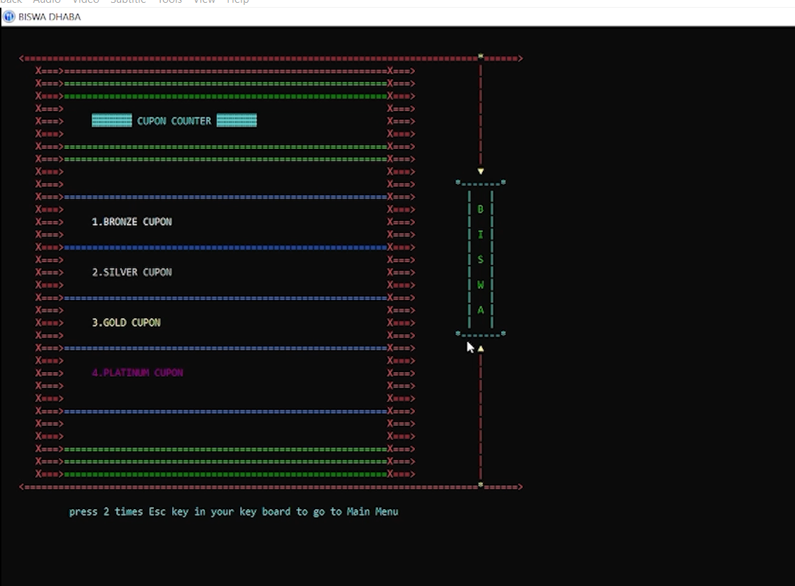

# RestuarentCumBar-C-PROJECT :star_struck: :open_file_folder: :computer: :closed_book:

 

***This new Restaurent Cum Bar using C is created by Biswarup Bhattacharjee, student of BTECH, in University of Engineering and Management, Kolkata.***

**Email Id: bbiswa471@gmail.com.** 

**Contact No: 916290272740.** 

## About :point_down: 

 
This is a Restaurent cum Bar. Here I have created main menu. Then there are various options like order section, bill section, coupon etc. In orders there are veg, non veg and alcoholic and non alcoholic drinks. Here I have added variety of items to make this applicatio user friendly and fun. Here are coupon and lucky draw games and options. Then there is billing section for customer. I have added various ideas of restaurant management. I have designedthe output using colours and lines. It is created using file handling and other C concepts.

## RESTAURENT CUM BAR DEMO VIDEO: :point_right: <a href="https://www.youtube.com/watch?v=m5VnSust32E&list=PL0lbDlMJ1h4g3cSTY44VyQ4Z-5L4kbo2a">Click here to watch</a>

## C and C++ PLAYLIST: :point_right: <a href="https://www.youtube.com/watch?v=m5VnSust32E&list=PL0lbDlMJ1h4g3cSTY44VyQ4Z-5L4kbo2a">Click here to watch</a>

## Folder Structure :point_down:

RESTAURENT CUM BAR
        └── r & b.c
        
## Screenshots :point_down: 

